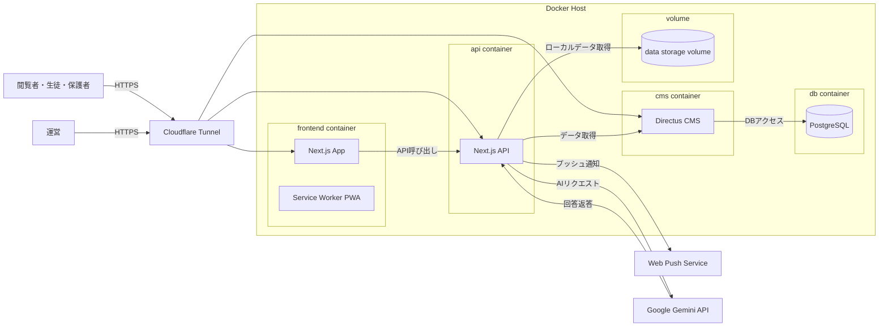

# 令和7年度うんどう会「謳花」特設サイト


本リポジトリでは、R7うんどう会「謳花」特設サイトのソースコードを保存しています。

**本リポジトリ及びその他の情報は生徒による自主的な活動です。本項目について所属高校は一切の責任を負わないものとし、電話・メール等での一切の連絡を禁じます**

---

## 技術スタック

- **フロントエンド**: Next.js (App Router) / React / TypeScript / Tailwind CSS
- **バックエンド(API)**: Next.js Route Handlers (Node.js runtime)
- **CMS**: Directus（ヘッドレスCMS、REST API経由）
- **通知**: Web Push (VAPID) + Service Worker
- **AI**: Google Generative AI (Gemini) SDK
- **その他**: Docker（Directusローカル開発）、PWA対応

---

## 全体構成



---

## 本システムが提供する体験

### 1. 競技及びイベント進行状況の表示
スケジュールAPIが競技の開始・終了時刻を参照し、現在進行中の競技と次の競技を判定します。

### 2. 運営側による手動調整
自動判定だけでは状況に追従できない場合に備え、手動順序・現在競技の上書きが可能です。運営側の判断を反映できるようにしています。

### 3. プッシュ通知
Web Pushによって重要なお知らせを配信できます。

---

## 主要機能

- **トップページ / 案内ページ**
  - 競技情報、プログラム、連絡事項の閲覧
- **お知らせ**
  - Directus からの公告取得・ヘッダー表示
- **競技情報**
  - Google Apps Script 経由の成績参照
- **スケジュール / Now Playing**
  - 現在進行中競技 / 次の競技の自動判定
  - 手動並び替え・上書き対応
- **AI Q&A**
  - 減点要項・競技要項のPDFに基づく質問応答
- **PWA & Web Push 通知**
  - 配信者側から一斉通知
- **デバッグ / 管理向けAPI**
  - Directusキャッシュクリア、ログ参照、通知テストなど

---

## ディレクトリ構成

```
app/              ルーティング（画面・API）
  api/            APIエンドポイント群
  ...             各ページ
components/       UIコンポーネント
lib/              Directus/PWA/スケジュール/通知関連ロジック
data/             端末/通知/上書き等のローカル保存先
 directus/         Directusローカル起動用
public/           画像、manifest、sw.js、PDF
```

---

## データモデル（Directus想定）

※実環境では権限や拡張に応じて調整されます。

- **announcements**
  - `title`, `body`, `status`, `show_in_header`, `date_created`, `date_updated`
- **contents**
  - `title`, `description`, `href`（または `herf` タイポに対応）
- **schedules**
  - `start_time`, `end_time`, `event`, `description`, `is_all_day`, `status`
- **blocks**（任意）
  - ブロック表現用（色・文言など）
- **emergency**（任意）
  - 緊急文言の表示制御
- **push_subscriptions**（Directus保存時）
  - `endpoint`, `payload`, `ua`

---

## 環境変数

`.env.local` に設定します

| 変数名 | 用途 |
| --- | --- |
| `NEXT_PUBLIC_DIRECTUS_URL` | Directus API URL |
| `DIRECTUS_STATIC_TOKEN` | Directus 認証トークン |
| `DIRECTUS_ALLOW_TOKEN_FALLBACK` | 認証失敗時にPublic読み取りへフォールバック |
| `WEB_PUSH_PUBLIC_KEY` | VAPID 公開鍵 |
| `WEB_PUSH_PRIVATE_KEY` | VAPID 秘密鍵 |
| `WEB_PUSH_CONTACT` | VAPID 連絡先 |
| `PUSH_STORE` | push購読保存方法（memory/directus/file） |
| `PUSH_FILE_PATH` | file保存パス |
| `NOTIFY_SECRET` | 通知送信APIの共通秘密 |
| `DEBUG_PASSWORD` | デバッグAPI用パスワード |
| `GOOGLE_API_KEY` | Gemini APIキー |
| `GEMINI_MODEL_NAME` | 使用モデル名 |

---

## APIリファレンス

### AI
- `POST /api/ai`
  - **用途**: PDF（減点要項/競技要項）を参照したQ&A
  - **Body**: `{ question: string, doc: 'genten' | 'kyougi' }`
  - **補足**: PDFは `public/genten.pdf` と `public/kyougi.pdf` を参照

### お知らせ
- `GET /api/announcements/list`
  - 公開済みお知らせ
- `GET /api/announcements/header`
  - ヘッダー表示用最新お知らせ

### コンテンツ
- `GET /api/contents`
  - Directus `contents` を取得
  - `?debug=1` で診断情報付与

### スケジュール
- `GET /api/schedules`
  - 公開済み全スケジュール
- `GET /api/schedules/current`
  - 現在進行中 + 次の競技
- `GET /api/schedules/current/all`
  - 進行中競技を全件
- `GET /api/schedules/upcoming?limit=3`
  - 未来の競技一覧
- `GET /api/schedules/template`
  - スケジュールテンプレート
- `GET/POST /api/schedules/order`
  - 手動順序（`DEBUG_PASSWORD`）
- `GET/POST /api/schedules/override`
  - 現在競技上書き（`DEBUG_PASSWORD`）

### Now Playing 設定
- `GET /api/now-playing`
  - 現在設定取得
- `PUT /api/now-playing`
  - 設定変更（`DEBUG_PASSWORD`）

### Web Push
- `GET /api/push/public-key`
  - VAPID公開鍵
- `POST /api/push/subscribe`
  - 購読登録
- `POST /api/push/send`
  - 通知一斉送信（`NOTIFY_SECRET`）

### 競技成績（GAS Proxy）
- `POST /api/competitions`
  - Body: `{ studentId: "0000" }`
  - Google Apps Script WebApp をサーバー側で代理実行

### デバッグ / 管理用
- `POST /api/debug/exec`
  - キャッシュクリア、ログ取得、通知テスト等
- `GET /api/debug/directus/status`
  - Directus接続診断

---

## 運用と再利用の考え方

### 再利用・転用の基本ステップ
1. **Directusの準備**
   - `directus/` で Docker 起動可能
   - `announcements`, `contents`, `schedules` などのコレクションを作成
2. **環境変数設定**
   - `.env.local` を作成し各値を設定
3. **PWA/通知の再生成**
   - VAPID鍵を生成して反映
4. **AI Q&AのPDF差し替え**
   - `public/genten.pdf`, `public/kyougi.pdf` を置換
5. **学校名・イベント名の更新**
   - `app/`配下ページ文言と本READMEを更新

### デプロイ方針の目安
- Next.js標準のビルド/起動で動作
- Directusは外部サーバーでもローカルでも可
- Web Push を使う場合はHTTPS必須

---

## 開発・起動

```bash
npm install
npm run dev
```

- http://localhost:3000 で確認

---

## Directus ローカル起動

```bash
cd directus
docker compose up -d
```

- 管理画面: http://localhost:8055

---


## Copyright
©2025-2026 R7浜松北高校執行委員会&うんどう会運営委員会「謳花」広報宣伝部署
